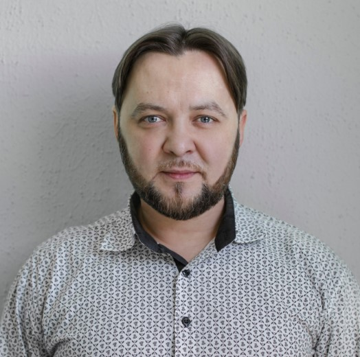

## Shkred Radmir ##



### My contacts:
#### Address
Litovsky Boulevard, 18
117588 Moscow, Russia
#### Phone numbers
+79919307010,
+380980368211
#### Email
psitecton@gmail.com

### About me

Extensive experience in the field of management and effective resolution of conflicts between
employees and acute issues with clients.

Positive qualities:
* the desire and ability to bring the work to the end, "save the lost" projects of other employees;
* the ability to resolve conflicts and disagreements as an "arbitrator";
* great desire and ability to understand new technologies, hard work, perseverance;
* a continuous process of learning something new.

### Hard skills

JavaScript, React, Redux,
TypeScript, SQL, OOP

Webstorm, Webpack, Gulp,
UnitTests

HTML, CSS, Sass, Less,
Scss, Bootstrap, Prepros

Photoshop, Figma, Avocode

jQuery, Git, REST, Axios,
Fetch, Regex

Nocode: Webflow, Bubble, Tilda

### An example of my work on Codewars

```JavaScript
function createPhoneNumber(numbers){
  const result = `(${numbers[0]}${numbers[1]}${numbers[2]}) ${numbers[3]}${numbers[4]}${numbers[5]}-${numbers[6]}${numbers[7]}${numbers[8]}${numbers[9]}`;
  return result;
}
```

### An example of my code on React.js

```JavaScript
import React from 'react';
import TodoListItem from "../todo-list-item";
import './todo-list.css';

const TodoList = ({todos, onDeleted, onToggleImportant, onToggleDone}) => {

    const elements = todos.map(item => {
        const {id, ...itemProps} = item;
        return (
            <li key={id} className="list-group-item">
                <TodoListItem
                    {...itemProps}
                    onDeleted={() => {
                        onDeleted(id);
                    }}
                    onToggleImportant={() => {
                        onToggleImportant(id);
                    }}
                    onToggleDone={() => {
                        onToggleDone(id);
                    }}
                />
            </li>
        );
    });

    return (
        <ul className="list-group todo-list">
            {elements}
        </ul>
    );
};

export default TodoList;
```

### Work experience

#### Oct 2020 - Feb 2021
#### frontend-intern, SoftServe, Кyiv
Throughout the marathon, we solved real small tasks in
mini‑groups, using SCRUM and Agile technologies. During this
time, the following skills were mastered:
Data types, Array methods, Functions, Exceptions
Template strings, Scoping, Closures, Spread, IIFE, Default
parameters, Arrow functions
Сlasses, this context(bind, call), Map/WeakMap/Set/WeakSet,
Symbol
Promise, async/await, Generators
Storage(local/session), Web workers, Service workers, Web
socket
Configuration of libraries(package.json, Webpack, ESLint, tsconfig,
Gulp, Babel)
JSX, Styles
Keys, State, Props, Events
Node, SCRUM theory
AJAX in React
Redux in React
Coupling and cohesion, Overloading, Overriding, Polymorphism,
Encapsulation, Inheritance, Abstraction, Interface, Aggregation,
Composition, Modularity
Routers
Tests
SyntheticEvent, Lifecycle
Refs, Higher‑Order, Component, DefaultProps
Virtual DOM, Hooks

#### Jun 2019 - Feb 2020
#### frontend-developer, SiteUp, Simferopol
Planning, development. Implementation of logic, working with
jQuery plugins, native JS.
Works in which I participated:
https://happylook‑sev.ru
http://zakupki82.ru
http://автовыкуп92.рф
https://стяжка‑пола‑крым.рф
https://волстрой92.рф

#### Dec 2018 - May 2019
#### frontend-developer, freelancer, Moscow
Self‑development of turnkey websites on the Webflow service.
Translation of websites to the WordPress platform, creation,
maintenance and support of admin panels, customer consultation.
4 sites were created. Of the current works:
http://йогамассаж.рф

### Education and qualifications
#### Sep 2008 - Jun 2011
#### МВА
Moscow Business School, Moscow

#### Sep 1995 - May 1999
#### Bachelor's degree, Faculty of Theology and History
Moscow Theological Seminary, Sergiev Posad

### Additional education

2021
**SoftServe**
React Online Marathon

2020
**Udemy**
Vladilen Minin, Frontend, JavaScript

2020
**Udemy**
Yuri Bura, Frontend, JavaScript

2020
**JavaMentor**
JavaMentor, Frontend, JavaScript

2018
**Training with a mentor**
Dmitry Trepachev (Minsk, Belarus), FRONTEND‑DEVELOPER (HTML, CSS, JavaScript, JQuery,
React)

2018
**Educational Center LOFTSCHOOL (Moscow)**
Web‑developer (HTML3, CSS5, JavaScript)

2018
**CYBERBIONIC‑SYSTEMATICS (ITVDN)**
CYBERBIONIC‑SYSTEMATICS (ITVDN, FRONTEND‑DEVELOPER (HTML, CSS, JavaScript,
JQuery, ReactJS)

2016
**"Specialist", Training Center at the Bauman University of Technology (Moscow)**
Basic JavaScript, level 1‑3

2016
**Ilya Kantor's School (Moscow)**
FRONTEND‑DEVELOPER (JavaScript, DOM, Interfaces)

2007‑2020
**English**
Moscow Institute of Linguistics, Intermediate

English Language School ITSTRESSCOACH, Upper‑Intermediate
